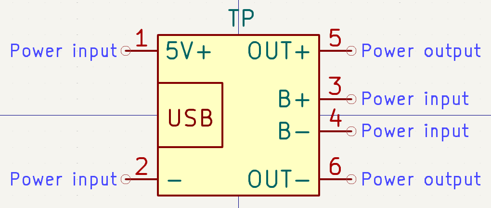
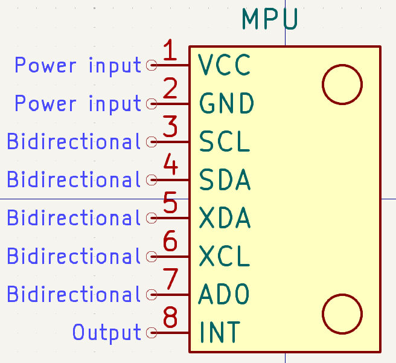
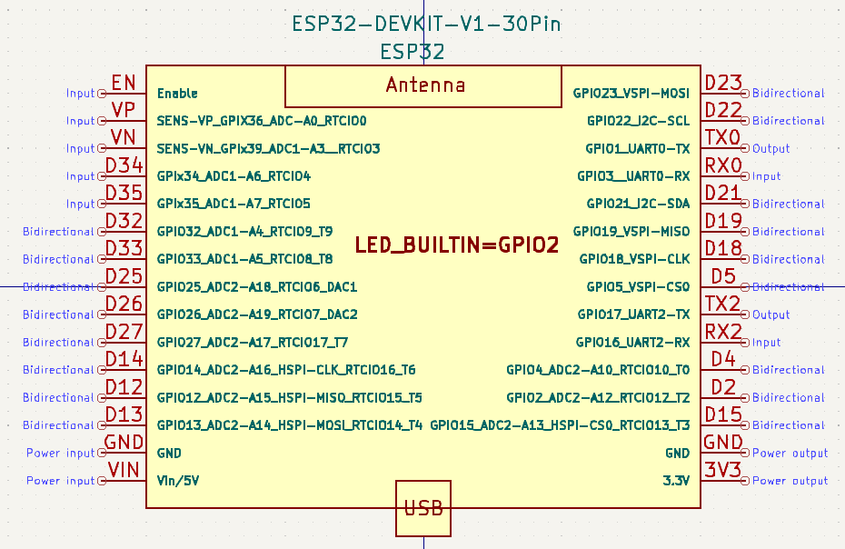
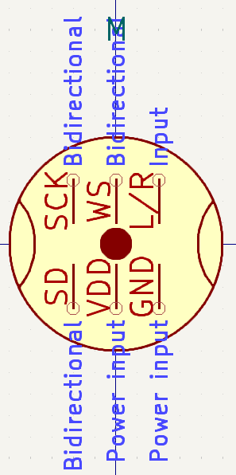
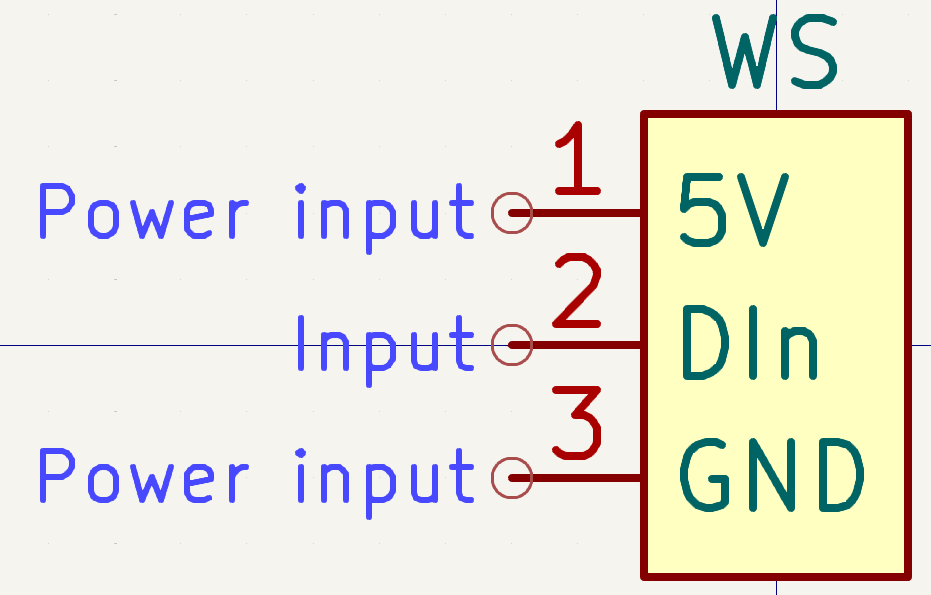
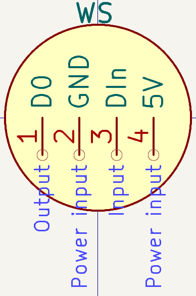

# KiCad-Custom-Parts

Repository to hold custom symbols, footprints, etc created for use in KiCad.

## Parts added (Symbols)

- TP4056 USB Module  
  

- MPU6050 Gyroscope Module  
  

- Waveshare ESP32-S3 Mini/Zero Development Board  
  https://www.waveshare.com/product/esp32-s3-zero.htm  
  

- ESP32-DEVKIT-V1-30Pin  
  

- DS3231 RTC For RaspberryPi  
  https://vishaworld.com/products/ds3231-high-precision-rtc-clock-module-for-raspberry-pi-with-battery  
  

- INMP441 Microphone I2S  
  

- WS2812B LED Strip  
  

- WS2812B Concentric Ring  
  
